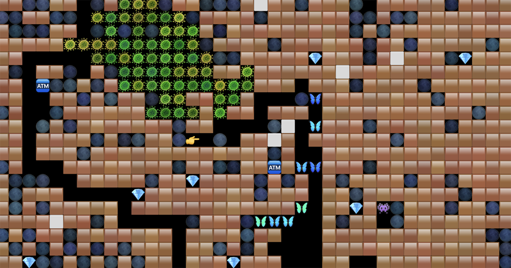

# RockFall

[Live Version](https://greggman.github.io/rockfall/)

## Make your own levels and contribute them here!

[See instructions here](https://greggman.github.io/rockfall/docs/making-levels.html).

## Rules

* 🙂 Player: A, S, D, W or ⬅️, ➡️, ⬆️,⬇️ to move

* 🟫 Dirt: Can be dug

* ⬜️ Wall: Unmovable, un-diggable, but explodable

* 🌑 Rock: Pushable left or right as long as no rocks are above the row.

* 💎 Diamond: 100 points

* 🦋 Butterfly: Turns left. If something falls on it or it touches an
  amoeba 🦠 it explodes into 9 eggs. Deadly to player.

* 🥚 Egg: Worth 10 points, Hatches into Butterfly

* 👾 Guardian: Turns right. If something falls on it explodes into
  space. Deadly to player.

* 🦠 Amoeba: Grows. If it reaches 100 Amoeba they all turn to eggs. If it's
  surrounded so it can't grow they all turn into diamonds.

* 🏧 Magic Wall: The first time something drops on it it turns on. While on, any
  rock or egg dropped on it will become a diamond. Any diamond dropped on it
  will become a rock. Stops after a few seconds.

Rocks, Eggs, and Diamonds will fall if there is space below them or if they are
sitting on top of another rock, egg, or diamond and there is space for them to
fall.

You can restart by clicking in the top left corner or select another level
by clicking the name.

Note: You can dig one tile without moving by holding shift.

The first level is random so and there is no real theme so it's just a proof of concept. In fact given it's random it's possible it's impossible to complete.
If so click the 🔄 icon to generate a new level.

A real game would require hand designed or algorithmically generated levels.

## Settings

These settings can be set with query parameters

| property      | default | description |
| ------------- | ------: | ----------- |
| amoebas       |       1 | number of amoebas |
| butterflies   |       5 | number of butterflies |
| diamonds      |      15 | number of diamonds |
| guards        |       3 | number of guardians |
| rocks         |     280 | number of rocks |
| walls         |      10 | number of walls |
| magicWalls    |       2 | number of magic walls |
| maxAmoebas    |     100 | how many amoebas when it turns into eggs |
| magicTime     |     250 | how many ticks the magic walls stay active |
| tileSize      |      32 | size of tiles (note | you can also Cmd/Ctrl +/- in browser) |
| scrollRate    |  0.0125 | scroll speed |
| diamondPoints |     100 | points for collecting diamond |
| eggPoints     |      10 | points for collecting egg |
| dirtPoints    |       1 | points for digging dirt |
| mapWidth      |      80 | map width in tiles |
| mapHeight     |      25 | map height in tiles |
| frameRate     |     0.1 | frame rate in seconds |
| colorVariation |      1 | color variation multiplier. Set to 0 for no variation |
| requiredCount |      15 | count (eggs + diamonds) needed to open exits |
| timeLimit     |    1500 | time limit in seconds |
| playerBoundsWidthPercent | 0.25 |  size of window to keep player inside |
| playerBoundsHeightPercent | 0.25 | size of window to keep player inside |
| level         |       0 | level to use (see [here](https://github.com/greggman/rockfall/blob/main/src/levels.js)) |

Examples:

* [larger level](https://greggman.github.io/rockfall/?mapWidth=200&mapHeight=200&rocks=8000&guards=80&butterflies=80&diamonds=100)
* [tiny level](https://greggman.github.io/rockfall/?mapWidth=10&mapHeight=10&rocks=2)
* [small tiles](https://greggman.github.io/rockfall/?mapWidth=100&mapHeight=100&tileSize=8&rocks=2000&guards=20&butterflies=20&diamonds=25)
* [faster](https://greggman.github.io/rockfall/?frameRate=0.0167&amoebas=10&maxAmoebas=1000&butterflies=2)
* [Magic Wall](https://greggman.github.io/rockfall/?level=1) (built with Tiled)
* [Hatchery](https://greggman.github.io/rockfall/?level=2) (built with Tiled)

## History

In the early 1980s, a game,
[BoulderDash](https://en.wikipedia.org/wiki/Boulder_Dash) came out for the Atari
800. My friend, John and I, got addicted and cleared all the levels.

At some point John tried to reproduce the main logic of the game. He did this in
a language called
[Action!](http://www.atarimania.com/utility-atari-400-800-xl-xe-action_12510.html).
It's pretty incredible to think someone stuck a language compiler and editor in
a 16k cartridge!

In any case, John got something working. [The code](https://github.com/greggman/rockfall/blob/master/ROCK4.ACT) was not all that big. As such, over the years I've ported it
several times. I [ported it to C](https://github.com/greggman/rockfall/blob/master/rockfall.c) at some point. According to the comments that was 1992.

I once ported it to Z80 assembly for the original GameBoy when I was first learning how it works.
I ported it to Java for some feature phone around 2003-2004 to bring to a job interview
at Namco Japan for their mobile division.

Recently (March 2022) I was going though some old backups and I saw it sitting there
and decided it might be fun to port it to JavaScript.

[My first attempt was to use emoji and Canvas 2D](https://greggman.github.io/rockfall/rockfall-emoji.html).

After that I thought it would be fun to use the tilemap shader I wrote for
[HFT-BoomBoom](https://github.com/greggman/hft-boomboom).

[This is the result](https://greggman.github.io/rockfall/).

Note: In the original, IIRC, Butterflies explode into diamonds, not eggs.
It would probably be best to make a 3rd enemy that explodes into diamonds
for the variety but in these random levels it's arguably more fun that butterflies
explode into eggs so you can see lots of movement.

## Design

Currently the first level is just randomly generated.

For this game to be fun really requires well designed levels. The original Atari
game had 60 or so levels. Each level had themes, a required number of items to
open the exit, and a time limit. In other words, if the level required 40
items then you'd need to collect 40 diamonds or eggs to open the exit and then make it
to the exit before the time limit. 

The first few levels were mostly just rocks, walls, and diamonds. Some levels
had less than the required diamonds but had butterflies so if you dropped rocks
on them they'd generate diamonds. Other levels, some diamonds might be
surrounded by walls so you need to lure guardians next to the walls and drop
rocks on their heads to explode the walls.

Another example was the magic wall. It turns rocks into diamonds
but you can only use it once. So, you'd need to dig around and push as many
rocks as possible into position and also dig out space below the magic wall
so that once you turned it on you could push all the rocks into the magic wall
and have them all turn into diamonds.

Yet another example was having the amoeba at the bottom of some level and you'd
need to find a way to surround it with rocks so that it turned into diamonds before
it grew too big and turned into eggs and then butterflies.

Anyway, all of those are interesting puzzles to solve but they require a level
designer. PRs welcome!

### Building levels

[See instructions here](https://greggman.github.io/rockfall/docs/making-levels.html).

## Enhancements / Ideas

At the moment I just used the system's emoji for graphics. Ideally, at a minimum,
someone would draw custom graphics including animated tiles for the gem spinning,
the butterfly flapping, the monsters moving, the amoeba oozing, the magic wall
animating, the egg hatching, explosions.

It might also be fun to try to make the graphics appear to not be tile based
but actually keep them tile based. Change the shader (or the game logic) to
add edge tiles. Add something to the shader to offset moving characters over time.
etc...

Add more rules, entities: The number one reason I wrote this was I thought it might
be fun to make more types of things. Random simple ideas:

* Enemies that only go left/right or up/down
* Enemies that path find
* Water (can flow left/right and go down, maybe Diamonds float up in water, maybe rocks fall slower)
* Gas (can flow left/right and go up, maybe can light gas on fire)
* Balloons (float up, opposite of rocks)
* Fire (spreads. Maybe need something burnable)
* Bombs (make chain explosions)
* Bomberman Bombs (bombs that fill space and eat just one edge of dirt)
* Ice Rocks (rocks that when pushed continue left/right)
* Diggers (enemies that dig dirt)
* Diamond eaters (enemies that eat diamonds)
* Diamond makers (enemies that eat rocks and hatch diamonds)
* Rotation (the GPU renderer can draw at any angle so, turn 45 degrees and have rocks slide. Or turn 90, 180, 270, and down is a new direction.
  this could be random, or time based, or there could be an object you touch to rotate or 4 objects to orient or drop a rock on etc...)

To be honest I think an actual shipping game would be best with a few core features
and then iterating on puzzles using those limited features. Otherwise the player
isn't given a change to master each feature. Still, experimenting could help find
the most interesting features and then you could choose the top 6-10 and build levels
from those

PRs and ideas welcome.

## Legal

I have no idea what the legal implications are. AFAICT, [Game Mechanics can not be
copyrighted](https://www.americanbar.org/groups/intellectual_property_law/publications/landslide/2014-15/march-april/not-playing-around-board-games-intellectual-property-law/)
but of course I am not a lawyer. Further, the game is 38yrs old so there are certainly
no valid patents. And of course, this is just derived. No idea how the original game
runs. In any case though, use at your own risk.

## LICENSE

The game is MIT, the levels are licensed by their respective creators. The license
and the creator detailed in the level file itself. If there is no license in the level
file then they are [CC-BY](https://creativecommons.org/licenses/by/4.0/).

To be clear, you have my permission to publish a commercial game based on this code but make sure
to provide attribution as required and make sure
you only include levels that have a compatible license. ([CC-BY](https://creativecommons.org/licenses/by/4.0), [CC-BY-ND](https://creativecommons.org/licenses/by-nd/4.0), [CC0](https://creativecommons.org/share-your-work/public-domain/cc0/))

Also, I'd love to know about it!