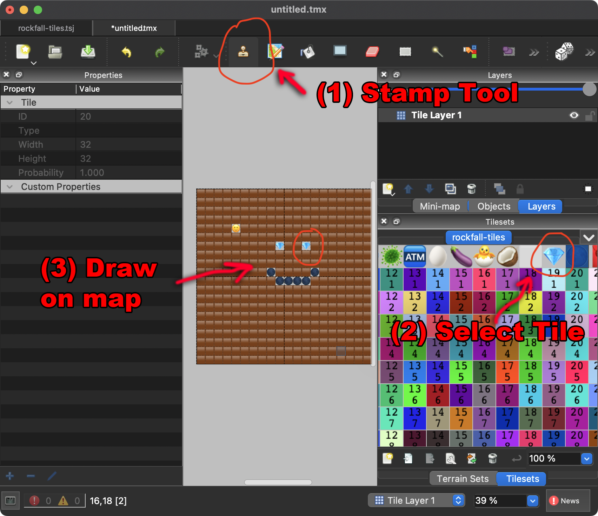
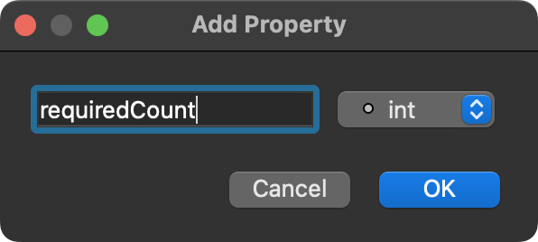

# How to make a level for Rockfall

1. Download and install [Tiled](https://www.mapeditor.org)

2. Download [rockfall-tiles.png](https://raw.githubusercontent.com/greggman/rockfall/main/tiled/rockfall-tiles.png) (⬅ right click this link and pick Save As..)

3. Download [rockfall-tiles.tsj](https://raw.githubusercontent.com/greggman/rockfall/main/tiled/rockfall-tiles.tsj)  (⬅ right click this link and pick Save As..)

4. Run Tiled and click Open File

   

5. Select the `rockfall-files.tsj` file

   

6. From the menus pick File->New->New Map...

   Then choose your map size

   

7. Create your map. 

   1. Select the Stamp Tool
   2. Click tile from the tileset
   3. Draw on the map

   

8. From the menus pick File->Save

   Make sure you choose the `.tmj JSON` format

   

9. Go to [the Rockfall WebSite](https://greggman.github.io/rockfall)

   Drag and Drop the `.tmj` file onto the game.

   

## Custom Properties

You can add custom properties to set level settings.

1. From the menus pick Map->Map Properties...

2. Click the [+] icon under Custom Properties

   

3. Specify the name and make sure the type is `int` or `string` (see below)

   

4. Click the property to edit

   

### Valid properties

| property      | default | type   | description |
| ------------- | ------: | :----: | ----------- |
| magicTime     |     250 | int    | how many ticks the magic walls stay active |
| diamondPoints |     100 | int    | points for collecting diamond |
| eggPoints     |      10 | int    | points for collecting egg |
| dirtPoints    |       1 | int    | points for digging dirt |
| requiredCount |      15 | int    | count (eggs + diamonds) needed to open exits |
| timeLimit     |    1500 | int    | time limit in seconds |
| author        |         | string | your name |
| license       |         | string | default CC-BY ([Creative Commons](https://creativecommons.org/share-your-work/) Only Please) |
| name          |         | string | default is filename |

Note: author, license, and name need to be type `string`

# Please consider submitting your level to this repo

If you know github then you can create a pull request. Otherwise,
[go to this issue](https://github.com/greggman/rockfall/issues/21)
and drag-&-drop your `.tmj` file